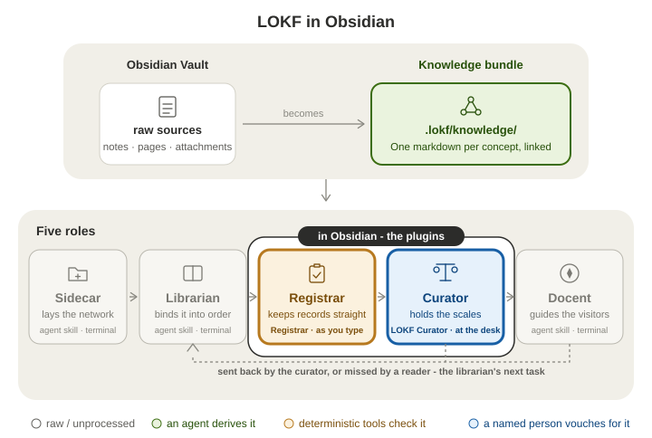

# msc-ai-galway-2026

An [Obsidian](https://obsidian.md) vault for a two-year, part-time MSc in Computer Science (Artificial Intelligence) at University of Galway, and a knowledge bundle beside it that grows out of the vault as the notes settle.

**The vault is the workshop. The bundle is the exhibition.** The workshop is where the degree happens - lectures, labs, papers, half-formed ideas - and it is the first half of this README. The exhibition is what has settled, kept in a form that tools and agents can check ([LOKF](https://lokf.nolan-nichols.com)): every record there says what it is, where it came from and who last checked it. It is the second half, and it can wait until the workshop has something worth showing. The workshop does not see the bundle, and the bundle holds nothing but records.

## Part 1 - The workshop: study in Obsidian

Open Obsidian → **Open folder as vault** → `MSc-AI/`. Nothing about the bundle shows here, and that is correct. Everything in this half is Obsidian doing what it does natively; the [Obsidian Help](https://obsidian.md/help) "Get started" pages (create a vault, first note, link notes) take ten minutes and are worth them.

### Your first hour

1. **Read `Home`**, then skim `CONVENTIONS`, both in `01-Dashboard/`. One rule to carry: folders say what *stage* a note is at; properties and links say what it is *about*.
2. **Install [Obsidian Web Clipper](https://obsidian.md/clipper)** in your browser and point its default template at `00-Inbox`. Clip the programme page and one module page. Every clip arrives with `title`, `source`, `author`, `published` and `created` properties, which is a citation for free; use the Highlighter to keep only the passages that matter.
3. **Drop PDFs into `60-Assets/PDFs/`**: the handbook, the first reading list. Obsidian opens PDFs itself. `[[paper.pdf#page=7]]` links to a page and `![[paper.pdf#page=7]]` embeds it beside your own words ([embeds](https://obsidian.md/help/embeds)).
4. **Open today's daily note** (the calendar icon in the ribbon, or the command *Daily notes: Open today's daily note*). It lands in `02-Daily/<year>/` from the `Daily note` template: what you studied, the questions, the `- [ ]` tasks. This is the habit that carries the rest.
5. **Take one lecture's notes** in `10-Programme/Modules/<CODE> - <Title>/` from the `Lecture note` template (*Templater: Create new note from template*). Wikilink every concept you meet, `[[Gradient Descent]]`, whether or not the note exists yet; Obsidian creates it when you click.
6. **Open `Vault.base`** in `01-Dashboard/`: Inbox, Lectures by module, Papers, Concepts, Daily, as live tables over the properties you just wrote. No plugin, no query language ([Bases](https://obsidian.md/help/bases)).
7. **End the week in the inbox.** Every clip and scribble gets its tags and moves to its folder, or is deleted. Then ask which concept note has stopped changing: that is what graduates (Part 2).

### What Obsidian gives you, and what to use it for

| Feature | Use it for |
| --- | --- |
| [Properties](https://obsidian.md/help/properties) | `tags`, `module`, `source`, `created` at the top of every note - what Bases and search read. Obsidian's own names plus the ones the Web Clipper writes, and nothing from the bundle's vocabulary |
| [Links](https://obsidian.md/help/links) and backlinks | `[[Note]]`, `[[Note#Heading]]`; the Backlinks pane shows who cites a concept, which is the graduation signal |
| [Tags](https://obsidian.md/help/tags) | `#lecture`, `#lab`, `#paper`, `#concept`; nested `#todo/ask` for finer slicing; `tag:#lab` in search |
| [Daily notes](https://obsidian.md/help/plugins/daily-notes) | one dated note per study day, templated, by year |
| [Templates](https://obsidian.md/help/plugins/templates) | the five in `90-Meta/Templates`; Templater (installed) runs the four with logic in them, the core plugin runs the daily one |
| [Bases](https://obsidian.md/help/bases) | database views over properties - table, cards, list, kanban, map - in `.base` files you can embed in a note |
| [Canvas](https://obsidian.md/help/plugins/canvas) | a whiteboard for a module map or a thesis argument; `.canvas` files, open JSON |
| [Web viewer](https://obsidian.md/help/plugins/web-viewer) | read a course page inside Obsidian, reader mode, save it to the vault (core plugin, off until you want it) |
| [Import](https://obsidian.md/help/import) | notes from Notion, OneNote, Evernote, Apple Notes and the rest, via the Obsidian team's Importer plugin |

### Plugins

Community plugins run third-party code, so Obsidian starts in *Restricted mode* until you [turn them on](https://obsidian.md/help/community-plugins). One is switched on in this vault: **Templater**, for the smarter templates (date, title, prompts). **LOKF Registrar** and **LOKF Curator** are installed here but off; they belong to the exhibition vault in Part 2 and would report *no bundle* if you turned them on.

One browser extension, which is not a vault plugin: **[Obsidian Web Clipper](https://obsidian.md/help/web-clipper)**, the official one. For a course that lives on the web, it is the essential piece.

Worth adding when the need is real, not before: **Zotero** with ZotLit or Zotero Integration once the reading list is long enough to need a reference manager (Zotero keeps the references and PDF annotations, Obsidian keeps the notes); **Excalidraw** for diagrams; **Obsidian Git** if you study from more than one machine, since this repository is the backup.

### Habits that hold

- One idea per note. Link before you file.
- Capture fast, file weekly. The inbox is allowed to be a mess for six days.
- The lecture note is the receipt; the concept note is the asset. Write the concept note the same week.
- Every paper note gets a `source:` (DOI or URL). It is what makes a claim checkable later, and what the exhibition will ask of it.
- Use the system before you build it. Add a folder, a tag or a base when a real note needs one.

## Part 2 - The exhibition: when a note has settled (optional)

A concept note graduates when it has stopped changing, two or more notes link to it, and you would be annoyed to find it wrong in six months (`CONVENTIONS.md` has the rule). Graduated notes become records in the **knowledge bundle**: `.lokf/knowledge/` beside the vault, one Markdown record per idea, each saying what it is, where it came from and who last checked it. That is [LOKF](https://lokf.nolan-nichols.com), which schema tools, CI and agents can validate and query. The vocabulary that makes a record checkable - `type`, `resource`, `status`, typed relations - lives only there; the workshop note keeps Obsidian's own properties, and the librarian does the translating.

<p align="center">
  
</p>

> **Two ways in.** This README is one; the other is a docent. Install [`lokf-docent`](https://github.com/noelmcloughlin/lokf-agent-skills) into whatever agent you already use - `npx skills add noelmcloughlin/lokf-agent-skills --skill lokf-docent --yes` - and ask it anything about this project - *What is self-attention, and who checked it?*, say. It answers from `.lokf/knowledge/`, the checked part of what the project knows, says how far each answer has been trusted (still a draft, checked by automation only, or confirmed by a named person), opens the source for exact values, and records what it couldn't answer so the gap gets filled. **Agents:** if `.lokf/knowledge/index.md` exists, read it first - `llms.txt` says how to weigh it.

**Open it as a second vault.** Obsidian → **Open folder as vault** → `knowledge_bundle`, the link at the repository root - the link itself, never the repository. One folder, two names: the skills, the `lokf` toolkit and CI address `.lokf/knowledge`; people and Obsidian open `knowledge_bundle`, the link `lokf-sidecar` lays beside every sidecar so that folder pickers, which hide dot-folders, have a name to pick. Its `.obsidian/` is committed with both plugins installed, on, and already listing this bundle's custom types; trust community plugins when asked. The status bar then reads **LOKF ✓**, every record well-formed, and **Confirmed 0/56**, the number this whole arrangement exists to raise.

**The loop.** Four roles from [`lokf-agent-skills`](https://github.com/noelmcloughlin/lokf-agent-skills), two of them also at your desk as plugins:

| Role | Who | Where |
| --- | --- | --- |
| **Librarian** | an agent derives and refreshes records from the vault and the public sources, marks them drafts | `lokf-librarian` in a terminal, or the scheduled workflow |
| **Curator** | you confirm, correct, retire or send back | [LOKF Curator](https://github.com/noelmcloughlin/obsidian-lokf-curator) in the exhibition vault, or `lokf-curator` in a terminal |
| **Registrar** | every record stays well-formed, and every `human:` confirmation is backed by evidence | [LOKF Registrar](https://github.com/noelmcloughlin/obsidian-lokf-registrar) as you type; `knowledge-registrar.yaml` on every pull request |
| **Docent** | answers questions from the bundle, with a trust label on each | `lokf-docent` in any agent |

**Try it once.**

1. In the exhibition vault open `concepts/self-attention`: a **Draft**, listed under *Worth ten minutes today* in the curator panel (the ribbon gem, or *Open curator panel*).
2. Press **Review this note**. The card puts the source (arXiv 1706.03762) beside the claim and asks whether the source still says this. Read §3.2 of the paper, then **Confirm**. The plugin asks for your curator id once (your GitHub login), appends a `human:` event under `verified`, clears `draft`, and writes a Curation line into `log.md`: **Confirmed 1/56**.
3. Open `concepts/transformer`: a draft with an `## Open questions` section the librarian left - which module introduces it first? If you know, **Wrong - I corrected it** and fix the `about` list; if not, **Later**.
4. Commit, signed, and open a pull request. The registrar workflow accepts a `human:` confirmation only from a signed commit or an approving review, and a solo maintainer cannot approve their own pull request; [knowledge-registrar.yaml](.github/workflows/knowledge-registrar.yaml) carries the three `git config` lines, [CONTRIBUTING.md](CONTRIBUTING.md) the rest.
5. Ask the docent *What is self-attention, and who checked it?* The footer now reads *confirmed by a person* - you, a minute ago.

**Tooling**, from `.lokf/` at the repository root:

```bash
cd .lokf
just lokf-install      # once: uv sync
just lokf-validate     # every record against msc-ai.yaml (LOKF core + this bundle's classes)
just lokf-check-refs   # every typed relation points at a record that exists
just lokf-serve        # SPARQL endpoint + graph explorer
just lokf-link         # recreate the knowledge_bundle link if a sync service or a Windows checkout dropped it
```

The four skills install at the repository root (gitignored):

```bash
npx skills add noelmcloughlin/lokf-agent-skills \
  --skill lokf-sidecar --skill lokf-librarian --skill lokf-curator --skill lokf-docent --yes
```

Run `lokf-librarian` from the repository root to refresh the bundle from the vault and the public sources; `lokf-curator` is the plugin's review session in a terminal; `lokf-docent` is the aside at the top; `lokf-sidecar` only repairs the sidecar's own files. CI runs `lokf validate` and the provenance gate on every pull request that touches the bundle; the scheduled librarian workflow stays inert until the `KNOWLEDGE_LIBRARIAN_ENABLED` repository variable is set.

**Read next:** the [`lokf-agent-skills`](https://github.com/noelmcloughlin/lokf-agent-skills) README for the four roles and why a person always holds the scales; the [LOKF Registrar](https://github.com/noelmcloughlin/obsidian-lokf-registrar) and [LOKF Curator](https://github.com/noelmcloughlin/obsidian-lokf-curator) READMEs for the plugins; [`.lokf/README.md`](.lokf/README.md) for this bundle's tooling and its small schema extension; the [LOKF specification](https://lokf.nolan-nichols.com) for the format itself.

## Layout

```text
msc-ai-galway-2026/                 one git repository
├── MSc-AI/                          THE WORKSHOP - open this folder in Obsidian
│   ├── 00-Inbox/ 02-Daily/ 10-Programme/ 20-Learning/ 30-Knowledge/ 40-Research/ 50-Projects/ 60-Assets/ 90-Meta/ 99-Archive/
│   ├── 01-Dashboard/                Home, CONVENTIONS, Vault.base, MOCs/
│   └── .obsidian/                   vault config; Templater on, the two LOKF plugins installed but off
├── .lokf/                           the sidecar: toolkit, schema extension, justfile, CI wrapper
│   └── knowledge/                   THE EXHIBITION - the bundle, one record per file
│       └── .obsidian/               its own vault config; both LOKF plugins installed and on
├── knowledge_bundle -> .lokf/knowledge    the doorway: open THIS in Obsidian to curate
├── .github/workflows/               registrar (validate + provenance gate), librarian (scheduled refresh), lint, release
├── llms.txt                         tells an agent to read the bundle first
└── inputs/                          where the 2026 programme extract was imported from; the file is gone, its records remain
```

## What the seeded notes show

Every seeded note is tagged `example`, one per stage from a raw capture to a graduated concept; `01-Dashboard/MOCs/Deep Learning` maps them. Delete them when the real ones arrive.

| State in the workshop | Note |
| --- | --- |
| No frontmatter - a raw capture | `00-Inbox/Attention scribbles` |
| Tagged and aliased, still changing, no `source` - not ready | `30-Knowledge/Concepts/Gradient Descent` |
| Episodic - stays in the vault for good | `10-Programme/Modules/CT5145 - Deep Learning/Week 1 - What deep learning is`; the lab in `20-Learning/`, whose settled facts became `concepts/gradient-descent` |
| Settled, sourced, linked from two notes - graduated | `30-Knowledge/Concepts/Self-Attention`, the paper note in `40-Research/` |

| Stage in the exhibition | Record |
| --- | --- |
| Draft, nobody has checked it | `concepts/self-attention` |
| Stable, checked by automation only | `concepts/gradient-descent`, `sources/vaswani-2017-attention-is-all-you-need` |
| Draft with an open question for the curator | `concepts/transformer` |
| Draft by nature - a contradiction between sources | the four records under `issues/` |
| Confirmed by a person | none yet - step 2 above writes the first |
| Retired | none yet - the **Retire** verb writes it |

A workshop note names the record it became by path (`concepts/self-attention`), never by wikilink: a wikilink cannot cross vaults, which is the point.

## Status and caveats

- Four `VerificationIssue` records are open: the public sources contradict each other on module count, core/optional status and the year/credit heading, and one assessment sentence reads as another course's. Nothing downstream depends on them.
- `base_iri` is the placeholder `msc-ai.example` (RFC 2606). It mints every `id`; migrate it before anyone links in.
- `msc-ai.yaml` extends the LOKF vocabulary with this bundle's own classes and keys (`Module`, `Programme`, `ects`, ...), and `just lokf-validate` checks every record against both. The recipe is the librarian skill's [domain-schema reference](https://github.com/noelmcloughlin/lokf-agent-skills/blob/main/skills/lokf-librarian/references/domain-schema.md).
- `.retired/` holds what the 2026-09-12 restructure took out; `git rm -r .retired` once you agree.

## Upstream

- [`lokf-agent-skills`](https://github.com/noelmcloughlin/lokf-agent-skills) · [`obsidian-lokf-registrar`](https://github.com/noelmcloughlin/obsidian-lokf-registrar) · [`obsidian-lokf-curator`](https://github.com/noelmcloughlin/obsidian-lokf-curator)
- [LOKF specification](https://lokf.nolan-nichols.com) · [`lokf` toolkit](https://pypi.org/project/lokf/) · [Obsidian Help](https://obsidian.md/help)

## Contributing, security, license

[CONTRIBUTING.md](CONTRIBUTING.md) covers the pre-PR checks, commit signing and how a release is cut; participation is covered by the [Code of Conduct](CODE_OF_CONDUCT.md), and [AI_COVENANT.md](AI_COVENANT.md) sets out how AI-assisted contributions are handled. Report security issues as [SECURITY.md](SECURITY.md) describes. Apache-2.0 - see [LICENSE](LICENSE) and [NOTICE](NOTICE).
